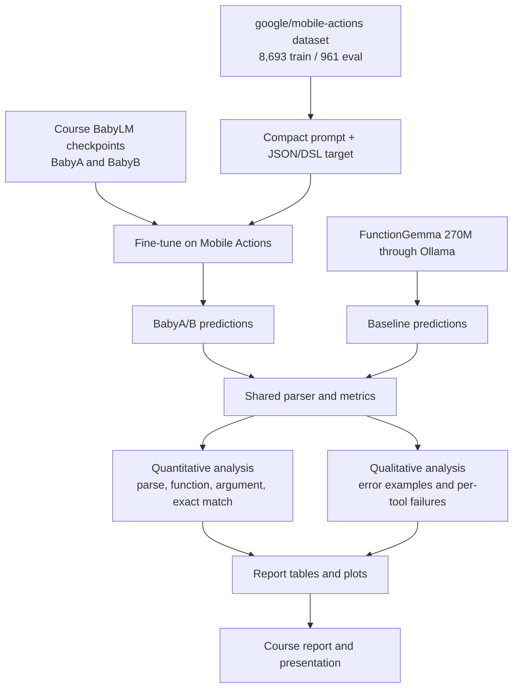

# BabyActionLM Project Flow

This file is the quick map for what we are doing and how the pieces connect.

## Big Picture

BabyActionLM is not an Android app. It is a neural NLP experiment:

1. Take natural-language mobile commands.
2. Convert each command into a structured tool call.
3. Fine-tune tiny BabyLM checkpoints from the course.
4. Compare them against a modern local function-calling baseline.
5. Analyze what worked, what failed, and whether BabyLM-style pretraining helped.

## Flow Diagram

## What We Reuse From The Course

- The BabyA/B model checkpoints trained in the assignments.
- The shared Baby tokenizer saved with those checkpoints.
- The course training pattern: Hugging Face `Trainer`, tiny LLaMA causal LM, conservative GPU settings.
- The BabyLM/BabyA/B framing as the scientific basis for comparing pretraining amounts.

We do not directly copy the old assignment helper script because it is older and has hard-coded paths. Instead, this repo uses the successful course artifacts as model inputs and implements a focused task pipeline around them.

## Step-By-Step Instructions

1. **Environment:** use Conda env `gpu-base`.
2. **Install:** run `python -m pip install -e .` from this repo.
3. **Smoke tests:** run `pytest` and the smoke configs before full experiments.
4. **Fine-tune BabyB:** train from `experiments/configs/babyB.yaml`.
5. **Fine-tune BabyA:** train from `experiments/configs/babyA.yaml`.
6. **Evaluate BabyA/B:** generate predictions and write summary/per-tool CSVs.
7. **Run FunctionGemma:** evaluate `functiongemma:270m` on the same eval split.
8. **Analyze:** create combined tables, plots, and qualitative examples.
9. **Write report:** explain quantitative results, error patterns, and limitations.
10. **v1.5 optional strengthening:** select prompt/target variants on a dev split from training rows, then evaluate the selected setup on the official eval split.

## Evaluation Checklist

- Use the same 961 eval examples for BabyA, BabyB, and FunctionGemma when runtime allows.
- Report parse rate, function accuracy, argument exact match, and exact tool-call match.
- Include per-tool breakdowns.
- Include qualitative examples: correct outputs, wrong function, malformed JSON, wrong/missing arguments.
- For v1.5, use `results/v15_trials.csv` to explain why the selected format was chosen.
- Discuss limits honestly: tiny context window, simulated actions, no real Android execution.
